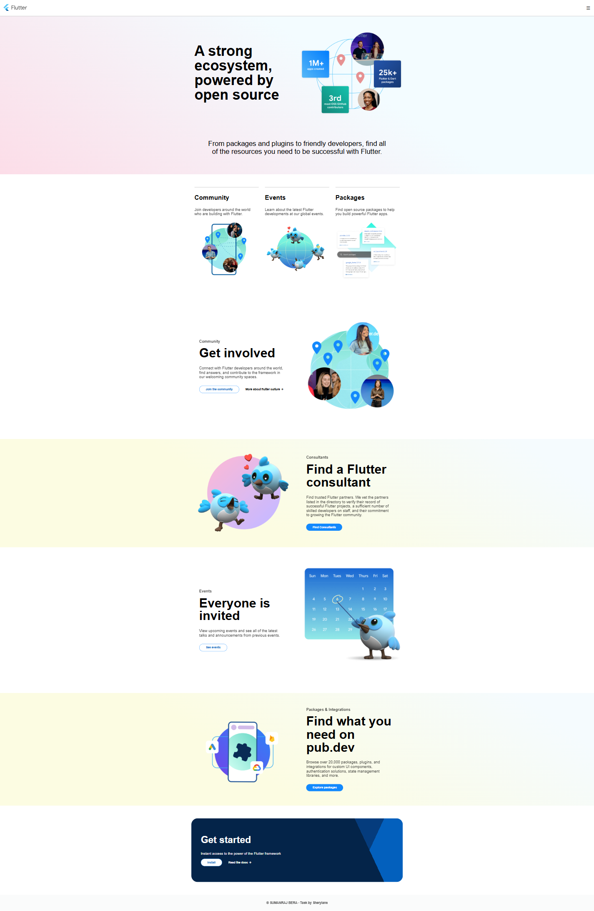
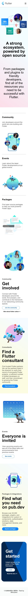

# Task: Create the flutter ecosystem webpage replica
- Creating the replica of the flutter ecosystem webpage
- Task completed successfully
- I only required two media queries but mostly the desktop view was major
- I also understood that to keep images from getting two big we can set a max-width
- The most important thing that we were taught in classes came to my realisation is why we shouldn't give max-width to main and why there was need for containers

## Task Completion

| Wide screen | Desktop | Mobile view|
|-------------|---------|------------|
||||
